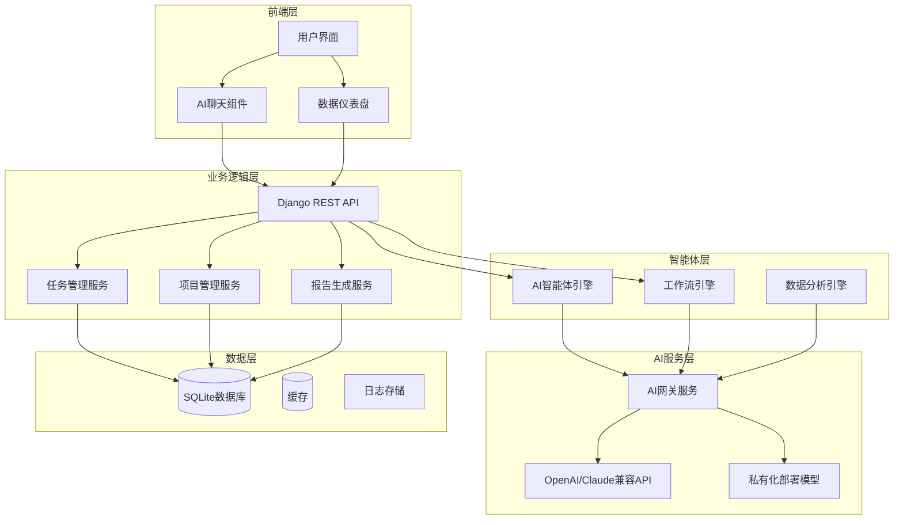
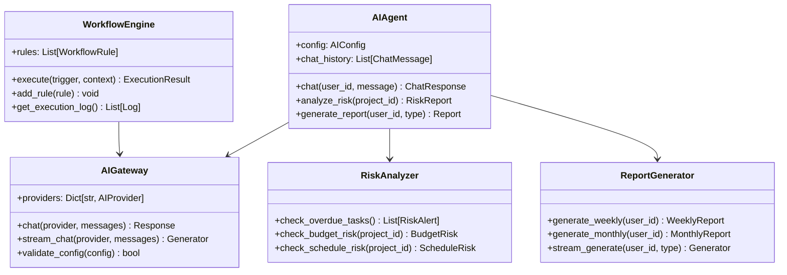
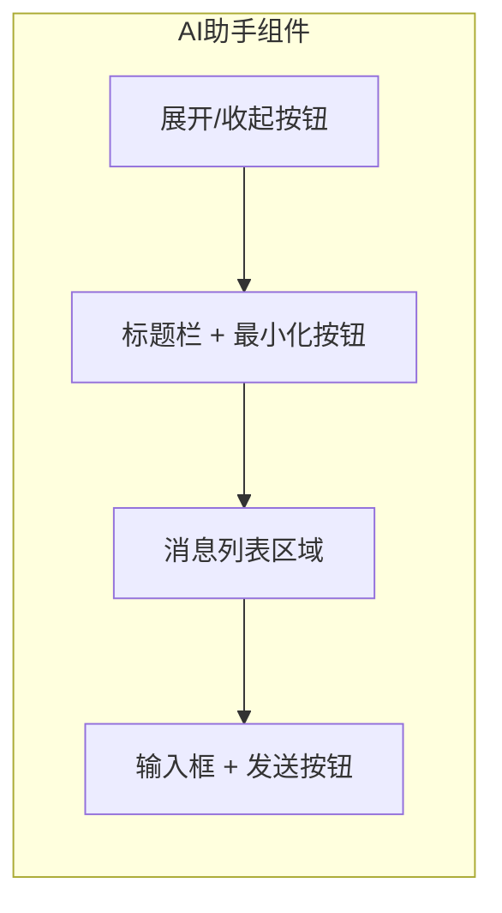
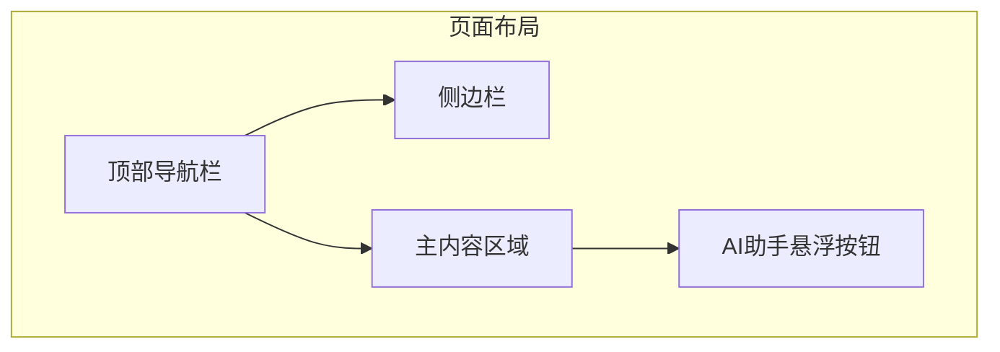

# AI PMS增强方案技术设计

功能名称：ai-pms-enhancement
更新日期：2026-03-31

## 描述

本技术设计文档详细描述了为项目管理系统（PMS）集成AI大模型、智能体和工作流功能的技术方案。系统将支持多种AI服务提供商，实现智能风险预警、自动报告生成、智能任务管理等核心功能，并升级用户界面设计。

## 系统架构



## 架构说明

### 分层设计

1. **前端层**：负责用户交互，包括AI聊天组件、数据仪表盘、主题切换等
2. **AI服务层**：统一管理多种AI服务提供商的接入，支持OpenAI/Claude兼容API和私有化部署模型
3. **智能体层**：核心AI逻辑处理，包括智能体引擎、工作流引擎和数据分析引擎
4. **业务逻辑层**：Django视图和业务服务，处理项目管理、任务管理等核心功能
5. **数据层**：SQLite数据库存储业务数据，缓存提升性能

### 核心组件



## 组件和接口

### 1. AI网关服务

**文件位置**：`pmsapp/services/ai_gateway.py`

```python
class AIGateway:
    """AI服务网关，统一管理多种AI服务提供商"""
    
    def chat(self, provider: str, messages: List[dict], stream: bool = True):
        """
        发送对话请求
        
        Args:
            provider: 服务提供商标识 ("openai", "claude", "private")
            messages: 消息列表，格式 [{"role": "user", "content": "..."}]
            stream: 是否使用流式响应
            
        Returns:
            字符串响应或生成器
        """
        pass
    
    def validate_config(self, config: dict) -> bool:
        """
        验证AI配置有效性
        
        Args:
            config: 配置字典
            
        Returns:
            验证是否通过
        """
        pass
```

### 2. AI智能体

**文件位置**：`pmsapp/services/ai_agent.py`

```python
class AIAgent:
    """AI智能体，处理各种AI任务"""
    
    def chat(self, user_id: str, message: str, session_id: str = None) -> ChatResponse:
        """
        处理用户对话请求
        
        Args:
            user_id: 用户ID
            message: 用户消息
            session_id: 会话ID，用于维护对话历史
            
        Returns:
            ChatResponse对象，包含响应内容和元数据
        """
        pass
    
    def analyze_risk(self, project_id: str) -> RiskReport:
        """
        分析项目风险
        
        Args:
            project_id: 项目ID
            
        Returns:
            RiskReport对象，包含风险等级、原因和建议
        """
        pass
    
    def recommend_assignee(self, task_data: dict) -> List[dict]:
        """
        智能推荐任务负责人
        
        Args:
            task_data: 任务数据，包含类型、预期工时等信息
            
        Returns:
            推荐负责人列表，按适合度排序
        """
        pass
```

### 3. 工作流引擎

**文件位置**：`pmsapp/services/workflow_engine.py`

```python
class WorkflowEngine:
    """工作流自动化引擎"""
    
    def add_rule(self, rule: WorkflowRule) -> bool:
        """
        添加工作流规则
        
        Args:
            rule: 工作流规则对象
            
        Returns:
            是否添加成功
        """
        pass
    
    def execute(self, trigger: str, context: dict) -> ExecutionResult:
        """
        执行触发的工作流
        
        Args:
            trigger: 触发器标识
            context: 上下文数据
            
        Returns:
            执行结果
        """
        pass
    
    def get_execution_log(self, rule_id: str = None) -> List[WorkflowLog]:
        """
        获取工作流执行日志
        
        Args:
            rule_id: 可选，按规则ID过滤
            
        Returns:
            日志列表
        """
        pass
```

### 4. REST API接口

#### AI配置接口

```
POST   /api/ai/config          - 保存AI配置
GET    /api/ai/config          - 获取AI配置
POST   /api/ai/config/validate  - 验证AI配置
```

#### AI对话接口

```
POST   /api/ai/chat            - 发送对话请求
GET    /api/ai/chat/history    - 获取对话历史
DELETE /api/ai/chat/history    - 清除对话历史
```

#### 智能分析接口

```
POST   /api/ai/analyze/risk    - 分析项目风险
POST   /api/ai/analyze/report  - 生成分析报告
POST   /api/ai/recommend/task  - 推荐任务分配
```

#### 工作流接口

```
GET    /api/workflow/rules     - 获取工作流规则列表
POST   /api/workflow/rules     - 创建工作流规则
PUT    /api/workflow/rules/:id - 更新工作流规则
DELETE /api/workflow/rules/:id - 删除工作流规则
GET    /api/workflow/logs      - 获取执行日志
```

## 数据模型

### 新增数据库表

#### AI配置表 (t_ai_config)

| 字段 | 类型 | 描述 |
|------|------|------|
| config_id | VARCHAR(32) | 配置ID |
| provider | VARCHAR(20) | 服务提供商 (openai/claude/private) |
| api_url | TEXT | API地址 |
| api_key | VARCHAR(256) | API密钥（加密存储） |
| model_name | VARCHAR(64) | 模型名称 |
| is_default | BOOLEAN | 是否默认配置 |
| created_at | DATETIME | 创建时间 |
| updated_at | DATETIME | 更新时间 |

#### AI对话历史表 (t_ai_chat_history)

| 字段 | 类型 | 描述 |
|------|------|------|
| history_id | VARCHAR(32) | 历史记录ID |
| user | FK(UserInfo) | 用户 |
| session_id | VARCHAR(64) | 会话ID |
| role | VARCHAR(10) | 角色 (user/assistant) |
| content | TEXT | 消息内容 |
| created_at | DATETIME | 创建时间 |

#### 工作流规则表 (t_workflow_rule)

| 字段 | 类型 | 描述 |
|------|------|------|
| rule_id | VARCHAR(32) | 规则ID |
| rule_name | VARCHAR(64) | 规则名称 |
| trigger_type | VARCHAR(32) | 触发类型 |
| trigger_condition | TEXT | 触发条件(JSON) |
| action_type | VARCHAR(32) | 动作类型 |
| action_config | TEXT | 动作配置(JSON) |
| is_enabled | BOOLEAN | 是否启用 |
| created_by | FK(UserInfo) | 创建人 |
| created_at | DATETIME | 创建时间 |

#### 工作流执行日志表 (t_workflow_log)

| 字段 | 类型 | 描述 |
|------|------|------|
| log_id | VARCHAR(32) | 日志ID |
| rule | FK(WorkflowRule) | 关联规则 |
| status | VARCHAR(16) | 执行状态 |
| trigger_data | TEXT | 触发数据 |
| result | TEXT | 执行结果 |
| error_message | TEXT | 错误信息 |
| executed_at | DATETIME | 执行时间 |

#### 风险预警表 (t_risk_alert)

| 字段 | 类型 | 描述 |
|------|------|------|
| alert_id | VARCHAR(32) | 预警ID |
| project | FK(ProjectInfo) | 项目 |
| alert_type | VARCHAR(32) | 预警类型 |
| risk_level | VARCHAR(16) | 风险等级 |
| description | TEXT | 描述 |
| suggestion | TEXT | 建议 |
| is_resolved | BOOLEAN | 是否已解决 |
| created_at | DATETIME | 创建时间 |

## 界面设计

### 主题切换机制

```css
/* 亮色主题变量 */
:root.theme-light {
    --bg-primary: #ffffff;
    --bg-secondary: #f8fafc;
    --text-primary: #18181b;
    --text-secondary: #52525b;
    --accent-color: #6366f1;
    --accent-hover: #4f46e5;
    --card-bg: #ffffff;
    --card-shadow: 0 4px 20px rgba(0, 0, 0, 0.08);
}

/* 暗色主题变量 */
:root.theme-dark {
    --bg-primary: #0a0a0f;
    --bg-secondary: #12121a;
    --text-primary: #f4f4f5;
    --text-secondary: #a1a1aa;
    --accent-color: #8b5cf6;
    --accent-hover: #6366f1;
    --card-bg: #1e293b;
    --card-shadow: 0 4px 20px rgba(0, 0, 0, 0.4);
}
```

### AI助手组件布局



### 页面结构



## 安全性设计

### API密钥加密

```python
from cryptography.fernet import Fernet
import base64
import hashlib

class KeyManager:
    """密钥管理器"""
    
    def __init__(self):
        # 使用项目SECRET_KEY生成加密密钥
        key = hashlib.sha256(settings.SECRET_KEY.encode()).digest()
        self.cipher = Fernet(base64.urlsafe_b64encode(key))
    
    def encrypt(self, plaintext: str) -> str:
        """加密API密钥"""
        return self.cipher.encrypt(plaintext.encode()).decode()
    
    def decrypt(self, ciphertext: str) -> str:
        """解密API密钥"""
        return self.cipher.decrypt(ciphertext.encode()).decode()
```

### CSRF保护

所有AI相关API请求都需要通过Django的CSRF中间件验证。

## 错误处理

### 错误分类

| 错误类型 | HTTP状态码 | 处理策略 |
|---------|-----------|---------|
| 配置无效 | 400 | 提示用户检查配置 |
| API调用失败 | 502 | 重试3次，失败后返回错误 |
| 服务超时 | 504 | 超时时间30秒 |
| 认证失败 | 401 | 提示重新配置API Key |
| 限流 | 429 | 提示用户稍后重试 |

### 错误响应格式

```json
{
    "success": false,
    "error": {
        "code": "AI_API_ERROR",
        "message": "AI服务调用失败",
        "details": "Connection timeout after 30s"
    }
}
```

## 性能优化

### 缓存策略

- AI配置信息：缓存至Redis或本地缓存，有效期24小时
- 对话历史：最近20条对话缓存至Redis
- 工作流规则：缓存至本地内存

### 异步处理

- 风险分析：使用Django Q集群异步执行
- 报告生成：支持流式输出，边生成边返回
- 工作流触发：异步执行，避免阻塞主线程

## 测试策略

### 单元测试

```python
# tests/test_ai_gateway.py
class TestAIGateway:
    def test_chat_openai(self):
        """测试OpenAI对话功能"""
        pass
    
    def test_validate_config(self):
        """测试配置验证"""
        pass

# tests/test_workflow.py
class TestWorkflowEngine:
    def test_add_rule(self):
        """测试添加工作流规则"""
        pass
    
    def test_execute_trigger(self):
        """测试触发执行"""
        pass
```

### 集成测试

- AI服务集成测试
- 工作流端到端测试
- 界面组件测试

## 实施计划

### Phase 1: 基础架构（1-2周）

1. 创建AI网关服务和配置管理
2. 实现基础的AI对话功能
3. 创建AI相关数据库模型

### Phase 2: 核心功能（2-3周）

1. 实现智能风险预警功能
2. 实现自动报告生成功能
3. 实现智能任务推荐功能

### Phase 3: 工作流自动化（2周）

1. 工作流引擎开发
2. 常用工作流模板实现
3. 执行日志和监控

### Phase 4: 界面优化（1-2周）

1. 主题切换功能完善
2. AI助手组件开发
3. 数据仪表盘美化

## 技术选型

| 组件 | 技术方案 | 说明 |
|------|---------|------|
| Web框架 | Django 4.x | 现有项目 |
| AI SDK | OpenAI Python SDK | 支持OpenAI兼容API |
| 流式输出 | Server-Sent Events (SSE) | 实现流式对话 |
| 异步任务 | Django Q | 工作流异步执行 |
| 加密 | cryptography.fernet | API密钥加密 |
| 前端 | Bootstrap 5 + 自定义CSS | 现有框架 |

## 参考资料

[^1]: (官方文档) - OpenAI API Reference - https://platform.openai.com/docs/api-reference
[^2]: (官方文档) - Django Documentation - https://docs.djangoproject.com/
[^3]: (官方文档) - Bootstrap 5 - https://getbootstrap.com/docs/5.3/
